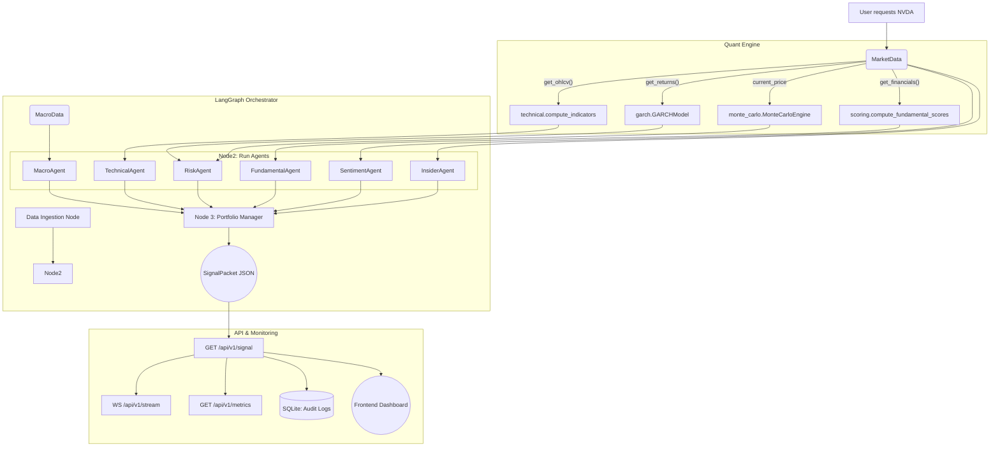

# AlphaAgent — Architecture & Function Map

> This document tracks the flow of data through the system, detailing which functions connect to which, what parameters they take, and what they output.
> *This file will be updated dynamically as we build.*

---

## 🏗️ 1. Data Layer (`data/`)
*The foundation. Handles fetching, caching, and cleaning raw market data.*

### `data.market.MarketData`
**Purpose:** The central hub for all stock data (wraps `yfinance`).
*   **Connected to:** Used by almost every agent and quant engine module.
*   **Variables:** `ticker` (str), `cache` (DataCache)
*   **Key Functions:**
    *   `get_ohlcv(period, interval)` → `pd.DataFrame`
        *   *Flow:* Checks `DataCache` → if missing, fetches from `yfinance` → cleans via `validate_ohlcv` → saves to cache → returns.
    *   `get_returns(period, method)` → `pd.Series`
        *   *Flow:* Calls `get_ohlcv` → computes log/simple returns via `compute_returns`.
    *   `get_info()` → `dict`
        *   *Flow:* Fetches company metadata (P/E, sector) → cleans via `validate_financials`.
    *   `get_financials()` → `dict` (Income, Balance Sheet, Cash Flow DataFrames)
    *   `get_options_chain(expiry_index)` → `dict`
    *   `get_insider_transactions()` → `pd.DataFrame`

### `data.cache.DataCache`
**Purpose:** Saves API responses to a local SQLite database to prevent redundant network calls.
*   **Connected to:** `MarketData` (and eventually `NewsData`, `MacroData`).
*   **Variables:** `db_path` (str)
*   **Key Functions:**
    *   `get(source, ticker, data_type)` → `dict` or `None`
        *   *Checks if data exists and TTL (Time-to-Live) hasn't expired.*
    *   `set(source, ticker, data_type, data, ttl_seconds)`
        *   *Saves JSON-serialized data to SQLite.*

### `data.validation`
**Purpose:** Mathematical data cleaning.
*   **Connected to:** `MarketData`.
*   **Key Functions:**
    *   `validate_ohlcv(df, ticker)` → `pd.DataFrame`
        *   *Action:* Removes zero-prices, forward-fills missing data (NaNs), swaps High/Low if backwards.
    *   `compute_returns(df, method)` → `pd.Series`
    *   `detect_outliers(series, method, threshold)` → `pd.Series` (Boolean mask)

---

## 🧮 2. Quant Engine (`quant_engine/`)
*The mathematical brain. Performs heavy calculations on the clean data.*

> **Updated May 2026** — 18 modules total. New additions: `heston.py`, `sabr.py`, `rough_vol.py`, `copula.py`, `granger.py`, `causal_engine.py`, `multifractal.py`, `lob.py`, `quantum_finance.py`

### New Modules (Tier 3/4 additions)

| Module | Theory | Key Formula / Output |
|--------|--------|---------------------|
| `heston.py` | Heston Stochastic Vol | dv=κ(θ−v)dt+ξ√v·dW₂ → closed-form IV surface |
| `sabr.py` | SABR Smile | σ_SABR(K,F,α,β,ρ,ν) Hagan formula → sticky-strike smile |
| `rough_vol.py` | Rough Vol (rBergomi) | H<0.5 fractional Brownian → realized vol clustering |
| `copula.py` | Copula Dependency | Gaussian/Clayton/Gumbel → tail co-dependence λ_L |
| `granger.py` | Granger Causality | F-test VAR(p): does news→price lag exist? |
| `causal_engine.py` | Do-Calculus DAG | Causal attribution → macro regime → factor driver |
| `multifractal.py` | Multifractal MF-DFA | h(q) generalized Hurst → scaling spectrum |
| `lob.py` | Limit Order Book Proxy | Effective spread + market impact model via OHLCV |
| `quantum_finance.py` | Quantum-Inspired | Amplitude estimation for option pricing (research) |


### `quant_engine.technical.compute_indicators`
**Purpose:** Calculates 10+ chart indicators and creates a 0-100 Bullish/Bearish score.
*   **Inputs:** `df` (OHLCV DataFrame from `MarketData.get_ohlcv`)
*   **Outputs:** `IndicatorResult` (dataclass)
*   **Connected to:** Will be called by `TechnicalAgent`.
*   **What it calculates inside:**
    *   `ta.momentum.RSIIndicator` → `rsi`
    *   `ta.trend.MACD` → `macd_line`, `macd_histogram`, `macd_crossover`
    *   `ta.volatility.BollingerBands` → `bb_upper`, `bb_pct_b`, `bb_signal`
    *   *Moving Averages* → `sma_50`, `sma_200`, `golden_cross`
    *   *Internal Helper:* `_compute_composite_score(IndicatorResult)` → adds up +1/-1 votes to generate the final `composite_score`.

### `quant_engine.macro` (Recession Math)
**Purpose:** Calculates the probability of an impending recession based on Federal Reserve data.
*   **Algorithms:** Yield Curve Inversion thresholds, Interest Rate restrictiveness, Unemployment metrics.

### `quant_engine.insider` (Smart Money Flow)
**Purpose:** Evaluates corporate insider transactions and institutional ownership.
*   **Algorithms:** Net share accumulation scoring, SEC Form 4 and 13F parsing.

### `quant_engine.garch.GARCHModel`
**Purpose:** Predicts future volatility and classifies the market's "crazy" level.
*   **Formula:** $\sigma_t^2 = \omega + \alpha \epsilon_{t-1}^2 + \beta \sigma_{t-1}^2$
*   **Simple Explanation:** Predicts tomorrow's "craziness" ($\sigma_t^2$) by looking at today's price shock ($\epsilon_{t-1}^2$) and yesterday's "craziness" ($\sigma_{t-1}^2$). It tells us if the market is entering a high-danger zone.
*   **Outputs:** `GARCHResult` (LOW/NORMAL/HIGH/EXTREME regime).

### `quant_engine.hmm.RegimeDetector`
**Purpose:** Unsupervised machine learning to detect Hidden Market States.
*   **Concept:** $P(S_t | S_{t-1})$ (Hidden State Transitions)
*   **Simple Explanation:** Like a weather station for the stock market. It looks at price patterns to decide if we are secretly in a **Bull**, **Bear**, or **Crisis** regime, even if it's not obvious yet.
*   **Math:** 3-State Gaussian Hidden Markov Model.

### `quant_engine.bayesian.BayesianFusion`
**Purpose:** Mathematically fuses independent probability estimates.
*   **Formula:** $L(A|B) = L(A) + L(B)$ (Log-Odds Addition)
*   **Simple Explanation:** If 5 agents vote, we can't just "average" them because they might be looking at the same data (Double Counting). This math merges their votes while penalizing "echo chambers" to find the one true probability.
*   **Math:** Log-odds Bayesian updating with correlation penalties.

### `quant_engine.monte_carlo.MonteCarloEngine`
**Purpose:** Simulates 10,000+ future price paths to find confidence intervals.
*   **Formula:** $S_t = S_0 e^{(\mu - 0.5\sigma^2)t + \sigma \sqrt{t} Z}$
*   **Simple Explanation:** It "rolls the dice" 10,000 times to see all possible futures for a stock. It tells us: "There is a 95% chance the price will stay between $X$ and $Y$ next week."
*   **Connected to:** `RiskAgent` (for stop losses) and UI fan charts.

### `quant_engine.scoring.compute_fundamental_scores`
**Purpose:** Calculates financial health and bankruptcy risk directly from accounting statements.
*   **Inputs:** `income_stmt`, `balance_sheet`, `cash_flow`, `info` (all from `MarketData`)
*   **Outputs:** `FundamentalScores` (dataclass)
*   **Connected to:** Will be called by `FundamentalAgent`.
*   **Key Metrics:**
    *   `piotroski_score` (0-9): Profitability, leverage, and efficiency.
    *   `altman_z_score`: Predicts bankruptcy probability within 2 years.

### `quant_engine.evt.ExtremeValueModel`
**Purpose:** Models extreme tail risk (Black Swan events).
*   **Formula:** $G(x; \xi, \sigma) = 1 - (1 + \xi x / \sigma)^{-1/\xi}$ (Generalized Pareto)
*   **Simple Explanation:** Normal math ignores crashes. This math *only* looks at historical crashes to predict the worst-case scenario. It answers: "If a 1-in-100 day crash happens today, how much will I lose?"
*   **Outputs:** Value-at-Risk (VaR) and Conditional VaR (CVaR).

### `quant_engine.kelly.KellyCriterion`
**Purpose:** Calculates optimal, mathematically sound position sizes.
*   **Formula:** $f^* = \frac{bp - q}{b}$
*   **Simple Explanation:** Tells you exactly what % of your money to bet. If your edge is small, it tells you to bet $10. If your edge is huge, it might say $2,000. It prevents you from going broke.
*   **Math:** Uses win probability ($p$), loss probability ($q$), and reward/risk ratio ($b$).

### `quant_engine.momentum.MomentumEngine`
**Purpose:** Calculates advanced momentum characteristics.
*   **Math:** Hurst Exponent (trend persistence) and 12M-1M academic momentum.

### `quant_engine.options_intel.analyze_options`
**Purpose:** Evaluates speculative positioning and hedging by reading options chains.
*   **Math:** Put/Call Open Interest Ratios and ATM Straddle implied moves.

### `quant_engine.signal_decay.SignalDecay`
**Purpose:** Calculates the exact expiration date of a trading signal.
*   **Formula:** $dX_t = \theta (\mu - X_t) dt + \sigma dW_t$ (Ornstein-Uhlenbeck)
*   **Simple Explanation:** Every signal has a "Half-Life." A news headline might be relevant for 2 days, while a fundamental score is relevant for 90 days. This math tells us exactly when the signal has "died" and it's time to exit the trade.
*   **Math:** Uses autocorrelation and Mean Reversion speed ($\theta$).

---

## 🤖 3. Agents (`agents/`)
*The decision-makers. They consume the Quant Engine math and output exact probabilities.*

### `agents.base.BaseAgent`
**Purpose:** The abstract interface all agents must inherit from.
*   **Key Functions:**
    *   `analyze(ticker, data)` → `AgentResult`
        *   *Action:* Wraps the internal `_run_analysis` with error handling, crash protection, and execution timing.

### `agents.registry.AgentRegistry`
**Purpose:** Reads `config/agents.yaml` to discover, load, and assign voting weights to enabled agents.
*   **Key Functions:**
    *   `get_agent_weight(name, regime)` → `float`
        *   *Action:* Dynamically adjusts agent voting power based on whether the market is normal or in a crisis.

### `agents.technical.TechnicalAgent`
**Purpose:** Reads charts and price action to determine the mathematical probability of an upward move.
*   **Inputs:** `MarketData.get_ohlcv()`
*   **Outputs:** `AgentResult` (dataclass)
*   **Connected to:** Uses `quant_engine.technical` for math.
*   **Flow:** Maps the 0-100 `composite_score` to a probability. Calculates confidence based on trend strength (ADX) and volume spikes.

### `agents.fundamental.FundamentalAgent`
**Purpose:** Reads SEC financial data to determine long-term company health.
*   **Inputs:** `MarketData.get_financials()`
*   **Outputs:** `AgentResult` (dataclass)
*   **Connected to:** Uses `quant_engine.scoring` for math.
*   **Flow:** Maps Piotroski F-Score to base probability. Slashes probability and flags warnings if Altman Z-Score indicates bankruptcy distress.

### `agents.sentiment.SentimentAgent`
**Purpose:** Reads news headlines and uses an LLM to gauge market mood.
*   **Inputs:** `MarketData.get_yfinance_ticker().news`
*   **Outputs:** `AgentResult` (dataclass)
*   **Connected to:** `google-genai` (Gemini 2.5 Flash).
*   **Flow:** Prompts Gemini to score the headlines 0-100 and provide a 2-sentence reasoning. Includes a keyword-based fallback simulator if the API key is missing.

### `agents.macro.MacroAgent`
**Purpose:** Determines if the broader economy is safe for investing.
*   **Inputs:** `MacroData.get_macro_snapshot()` (FRED Data)
*   **Outputs:** `AgentResult` (dataclass)
*   **Connected to:** `quant_engine.macro`
*   **Flow:** Analyzes the yield curve and Fed funds rate. If recession risk is high, it outputs a heavily BEARISH probability to protect the portfolio.

### `agents.insider.InsiderAgent`
**Purpose:** Tracks "Smart Money" by monitoring SEC filings.
*   **Inputs:** `MarketData.get_insider_transactions()`, `MarketData.get_major_holders()`
*   **Outputs:** `AgentResult` (dataclass)
*   **Connected to:** `quant_engine.insider`
*   **Flow:** Scores net insider buying and institutional ownership percentages to determine conviction.

### `agents.risk.RiskAgent`
**Purpose:** Calculates safe position sizing and acts as a circuit breaker for extreme volatility.
*   **Inputs:** `MarketData.get_returns()`, `MarketData.get_current_price()`
*   **Outputs:** `AgentResult` (dataclass)
*   **Connected to:** `quant_engine.garch`, `quant_engine.monte_carlo`
*   **Flow:** Never predicts up/down (probability is always 50%). Uses GARCH to determine the risk regime and Monte Carlo 95% Confidence Intervals to determine Value-at-Risk (VaR).

---

## 🧠 4. The Orchestrator (`orchestrator/`)
*The Lead Portfolio Manager. Uses LangGraph to run the workflow and aggregate votes.*

### `orchestrator.graph.build_alpha_graph`
**Purpose:** Compiles the LangGraph state machine.
*   **Nodes:**
    1.  `data_ingestion_node`: Pre-warms the cache.
    2.  `run_agents_node`: Executes Technical, Fundamental, Sentiment, Macro, Insider, and Risk agents.
    3.  `portfolio_manager_node`: Collects agent results, applies `agents.yaml` weights, overrides rules if the Risk Agent declares a CRISIS, and outputs the final `SignalPacket`.

---

## 🌐 5. The API & Monitoring Layer (`api/`)
*The delivery mechanism and observability hub.*

### `api.main` (FastAPI 2.0 Server)
**Purpose:** The high-performance gateway for the AlphaAgent engine.
*   **Endpoints:**
    *   `GET /api/v1/signal/{ticker}`: Triggers the full 7-agent pipeline and returns the `SignalPacket` as JSON.
    *   `WS /ws/v1/stream/{ticker}`: Streams agentic reasoning step-by-step (WebSocket).
    *   `GET /api/v1/metrics`: Returns real-time telemetry (latency, agent success rates).
    *   `GET /api/v1/history`: Returns past trade signals and audit logs.

### `api.monitoring.Monitor`
**Purpose:** Collects performance telemetry for the dashboard.
*   **Tracks:** Latency per agent, total requests, error rates, and system uptime.

---

## 🗄️ 6. Persistence & Audit Layer (`database/`)
*The system memory. Ensures every decision is audit-trail compliant.*

### `database.manager.DatabaseManager`
**Purpose:** Handles SQLite connection pooling and CRUD operations.
*   **Connected to:** `api.main`
*   **Key Functions:**
    *   `record_signal(ticker, signal_data, agents)`: Saves the final signal and the full reasoning/vote of *every* agent involved in the decision.

### `database.models` (SQLAlchemy)
**Purpose:** Defines the relational schema for AlphaAgent.
*   **Tables:** `trades` (History), `portfolio` (Holdings), `agent_logs` (Performance tracking).

### `agents.state` (The Data Contracts)
**Purpose:** Defines the exact shape of data that moves between modules.
*   **Connected to:** Everything.
*   **Key Schemas (Pydantic Models):**
    *   `AgentResult`: The standard output format for *every* analysis agent.
        *   *Vars:* `probability_up`, `confidence`, `reasoning`, `factor_scores`.
    *   `SignalPacket`: The final output of the entire system.
        *   *Vars:* `direction`, `conviction_pct`, `agent_results`, `monte_carlo`, `risk_metrics`.

---

## 🚀 Execution Flow (How it connects so far)


```
