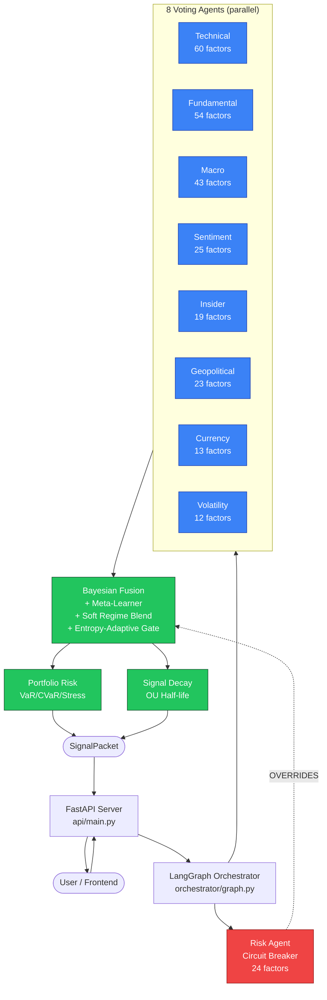
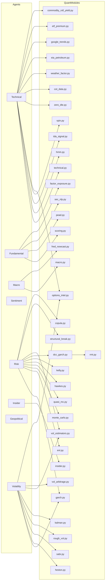
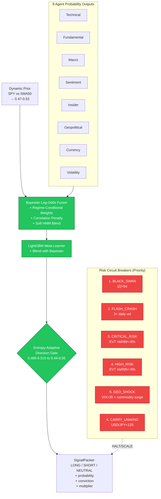
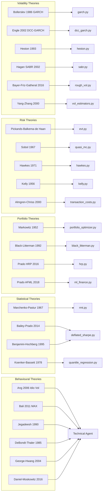
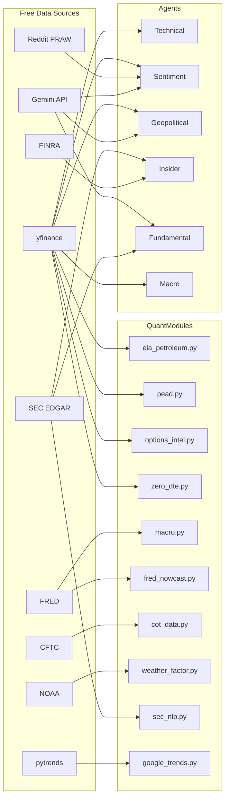
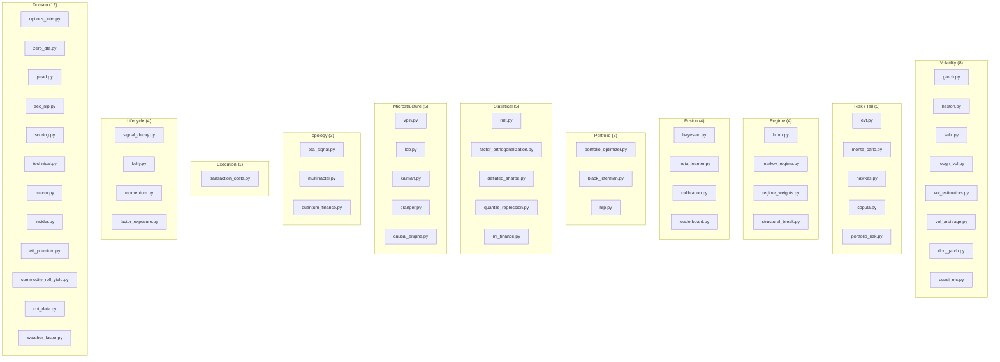
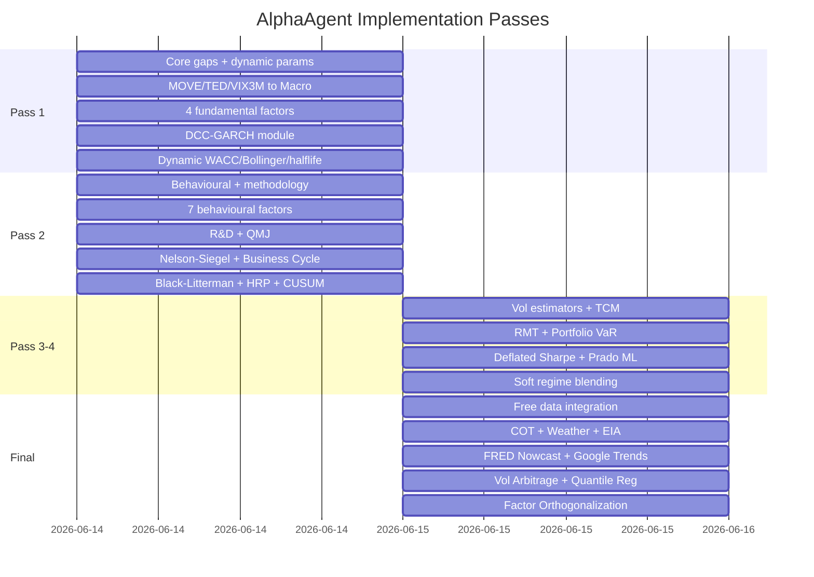
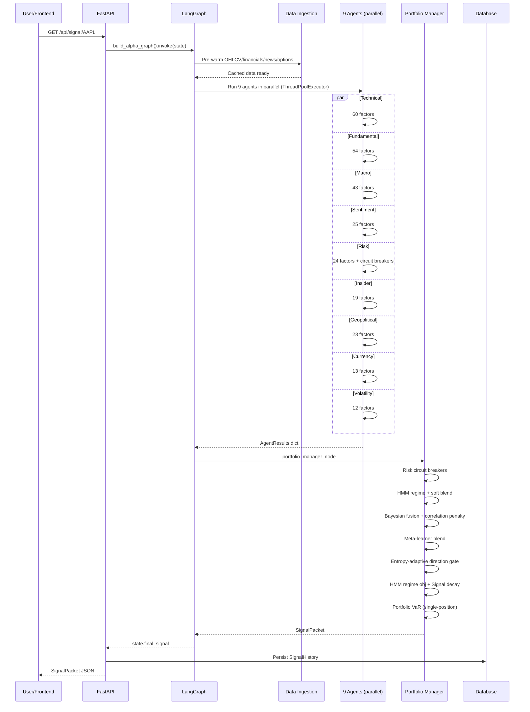

# AlphaAgent — Project Graph Memory

> **Visual companion to `PROJECT_GRAPH.json`.** Same knowledge graph in Mermaid form, for humans and for any agent that renders markdown.
>
> Pair this with `PROJECT_GRAPH.json` for machine queries, `PROJECT_AUDIT.md` for architecture deep-dive, and `COMPLETE_INVENTORY.md` for the full factor list.

---

## 1. High-Level System Flow



---

## 2. Agent → Quant Module Dependencies



---

## 3. Bayesian Fusion Hierarchy



---

## 4. Theory → Module Implementation Map



---

## 5. Data Source → Module Map



---

## 6. Module Categories (37 Modules in 11 Buckets)



---

## 7. Implementation Lineage (4 Passes)



---

## 8. End-to-End Request Flow



---

## 9. Query Examples (For Other Agents)

Other agents can ask these questions of `PROJECT_GRAPH.json`:

| Question | JSON Query |
|----------|-----------|
| **What modules does Risk agent use?** | `edges WHERE source='agent_risk' AND type='USES'` |
| **What theory does DCC-GARCH implement?** | `edges WHERE source='qm_dcc_garch' AND type='IMPLEMENTS'` |
| **What agents read from yfinance?** | `edges WHERE target='ds_yfinance' AND type='READS_FROM'` |
| **Which circuit breakers halt trading?** | `nodes WHERE type='circuit_breaker' AND priority<=2` |
| **What was added in Pass 4?** | `nodes WHERE added_in_pass=4` |
| **What feeds into Bayesian fusion?** | `edges WHERE target='qm_bayesian' AND type='FEEDS_INTO'` |
| **Which modules in 'volatility' category?** | `nodes WHERE type='quant_module' AND category='volatility'` |
| **What does the orchestrator coordinate?** | `edges WHERE source='orchestrator' AND type='COORDINATES'` |
| **Which API endpoints exist?** | `nodes WHERE type='api_endpoint'` |
| **Theories by López de Prado?** | `nodes WHERE type='theory' AND author CONTAINS 'Prado'` |

---

## 10. Quick Stats

| Metric | Count |
|--------|-------|
| Agents (voters) | 8 |
| Agents (circuit breakers) | 1 |
| Quant engine modules | 37 |
| Academic theories implemented | 60+ |
| Free data sources | 10 |
| Factors across all agents | 271 |
| Circuit breakers | 6 |
| Dynamic parameters | 6 |
| API endpoints (REST + WS) | 10 |
| Frontend tabs | 6 |
| Database tables | 6 |
| Implementation passes | 4 |

---

## 11. How to Share This Memory

**For another Claude Code instance:**
```
1. Copy these 4 files to the new project:
   - PROJECT_GRAPH.json       (machine-readable graph)
   - PROJECT_GRAPH.md          (this file — visual)
   - PROJECT_AUDIT.md          (architecture deep-dive)
   - COMPLETE_INVENTORY.md    (every factor enumerated)

2. Tell the new agent: "Read PROJECT_GRAPH.json + PROJECT_AUDIT.md first.
   That's the system. Use COMPLETE_INVENTORY.md as the factor reference."

3. The new agent can query the JSON graph to answer questions about
   dependencies, theory mapping, data sources without re-reading source code.
```

**For another agent framework (LangChain/AutoGen/CrewAI):**
```python
# Load the graph
import json
with open("PROJECT_GRAPH.json") as f:
    project_graph = json.load(f)

# Find all modules that implement a Prado theory
prado_theories = [n["id"] for n in project_graph["nodes"]
                  if n["type"] == "theory" and "Prado" in n.get("author", "")]
prado_modules = [e["source"] for e in project_graph["edges"]
                 if e["target"] in prado_theories and e["type"] == "IMPLEMENTS"]
print(prado_modules)
# → ["qm_hrp", "qm_ml_finance", "qm_deflated_sharpe"]
```

**For a non-technical reader:**
Just open this file (`PROJECT_GRAPH.md`) in a Markdown viewer with Mermaid support
(GitHub, VS Code with Mermaid extension, or any Mermaid-aware tool). The diagrams
render visually.

---

**End of Project Graph Memory.** Pair with `PROJECT_GRAPH.json` for machine queries.
