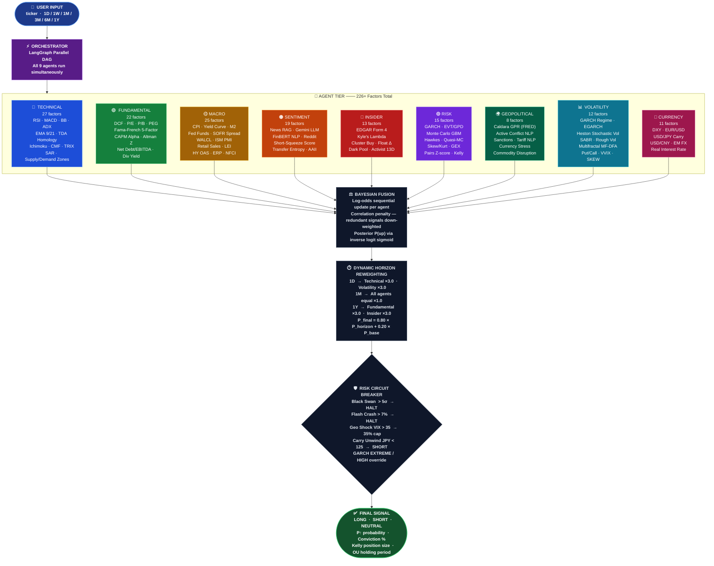

<div align="center">


<br/><br/>

```
░█████╗░██╗░░░░░██████╗░██╗░░██╗░█████╗░░░░░░░░█████╗░░██████╗░███████╗███╗░░██╗████████╗
██╔══██╗██║░░░░░██╔══██╗██║░░██║██╔══██╗░░░░░░██╔══██╗██╔════╝░██╔════╝████╗░██║╚══██╔══╝
███████║██║░░░░░██████╔╝███████║███████║░░░░░░███████║██║░░██╗░█████╗░░██╔██╗██║░░░██║░░░
██╔══██║██║░░░░░██╔═══╝░██╔══██║██╔══██║░░░░░░██╔══██║██║░░╚██╗██╔══╝░░██║╚████║░░░██║░░░
██║░░██║███████╗██║░░░░░██║░░██║██║░░██║░░░░░░██║░░██║╚██████╔╝███████╗██║░╚███║░░░██║░░░
╚═╝░░╚═╝╚══════╝╚═╝░░░░░╚═╝░░╚═╝╚═╝░░╚═╝░░░░░░╚═╝░░╚═╝░╚═════╝░╚══════╝╚═╝░░╚══╝░░░╚═╝░░░
```

**Production-Grade · Multi-Agent · Quantitative Trading Intelligence**

*9 specialist agents — 226+ factors — 19 quant engine modules — real-time LLM reasoning — dynamic horizon weighting*

<br/>

> ⚠️ **Educational & Research Use Only — This is NOT financial advice.**

</div>

---

## 🗂️ Table of Contents

| | | |
|---|---|---|
| [⚡ What is AlphaAgent?](#-what-is-alphagent) | [🏗️ System Architecture](#️-system-architecture) | [🔬 Tech Stack Architecture](#-tech-stack-architecture) |
| [🤖 The 9 Agents](#-the-9-specialist-agents) | [📐 Quant Engine](#-quant-engine-modules) | [⏱️ Horizon Weighting](#️-dynamic-horizon-weighting) |
| [🛡️ Circuit Breakers](#️-risk-circuit-breakers) | [🖥️ Dashboard](#️-dashboard-tabs) | [📡 API Reference](#-api-reference) |
| [🔌 Data Sources](#-data-sources) | [🚀 Quick Start](#-quick-start) | [📁 Project Structure](#-project-structure) |

---

## ⚡ What is AlphaAgent?

AlphaAgent is a **production-grade agentic AI trading signal system** that runs **9 specialist agents in parallel** using LangGraph, fuses their outputs through a **Bayesian correlation-adjusted blend**, and delivers a final **LONG / SHORT / NEUTRAL** probability signal with full reasoning transparency.

```
Every signal answers three questions:
  ① DIRECTION  →  LONG / SHORT / NEUTRAL
  ② CONFIDENCE →  P(up) probability (0–100%) + conviction % + agent vote breakdown
  ③ TIMING     →  Ornstein-Uhlenbeck mean-reversion half-life → optimal holding period
```

**What sets it apart:**

| Feature | AlphaAgent | Typical Screener |
|---|:---:|:---:|
| Real-time LLM news sentiment | ✅ Gemini 2.0 Flash RAG | ❌ |
| Parallel agent execution | ✅ LangGraph DAG | ❌ |
| GARCH + EVT tail risk | ✅ True quant math | ❌ |
| Bayesian probability fusion | ✅ Correlation-adjusted | ❌ |
| Time-horizon reweighting | ✅ 6 horizons | ❌ |
| Hard circuit breakers | ✅ Black Swan / Flash Crash halt | ❌ |
| Topological Data Analysis | ✅ Persistent homology H0/H1 | ❌ |
| Hawkes self-exciting process | ✅ Jump cascade detection | ❌ |

---

## 🏗️ System Architecture



---

## 🔬 Tech Stack Architecture


---

## 🤖 The 9 Specialist Agents

| # | Agent | 🎨 | Factors | Key Theories & Signals |
|---|-------|:--:|:-------:|---|
| 1 | **Technical** | 🔵 | 27 | RSI · MACD · BB · ADX · EMA 9/21 · TDA Persistent Homology · Ichimoku Cloud · Chaikin MF (CMF-14) · TRIX · Parabolic SAR · Supply/Demand Zones · Volume Profile POC · Chart Patterns · Fibonacci · Pivot Points · OFI · Cross-Sectional Rank |
| 2 | **Fundamental** | 🟢 | 22 | DCF · P/E · P/B · PEG · Fama-French 5-Factor · CAPM Jensen's Alpha · Altman Z · Beneish M · Graham Number · Net Debt/EBITDA · Dividend Yield+Payout · Earnings Call NLP (Gemini) · Earnings Revision Momentum |
| 3 | **Macro** | 🟡 | 25 | 10Y-2Y Yield Curve · CPI · PCE · Fed Funds · SOFR Spread · WALCL · ISM PMI · Retail Sales (RSXFS) · LEI (USSLIND) · HY OAS (BAMLH0A0HYM2) · ERP · NFCI · Amihud · Bond-Equity ρ · Real Rate (Fisher) |
| 4 | **Sentiment** | 🟠 | 19 | News RAG (Gemini 2.0 Flash) · FinBERT-Style NLP · Reddit Sentiment · News Decay Model · Short-Squeeze Score · Unusual Options Activity · Short Interest · Fear & Greed · Transfer Entropy · Shannon Entropy · AAII · Source Credibility |
| 5 | **Insider** | 🔴 | 13 | EDGAR Form 4 · Kyle's Lambda · Float Reduction · Insider Cluster · FINRA Short Vol (RegSHO) · ETF Flow Impact · Activist 13D/SC 13G · Top-10 Holder HHI · Dark Pool Print Ratio (FINRA ADF) |
| 6 | **Risk** | 🟣 | 15 | GARCH(1,1) · EVT/GPD · Monte Carlo GBM · Kelly Criterion · Hawkes Process · Quasi-MC Sobol · KL Divergence · Rolling Sharpe/Sortino (63d) · Vanna/Charm · Skewness/Kurtosis · Options GEX Wall · Pairs Z-score |
| 7 | **Geopolitical** | 🌍 | 8 | Caldara-Iacoviello GPR (FRED) · VIX Event Spike · Active Conflict NLP · Sanctions NLP · Tariff/Regulatory NLP · Currency Stress Index · Commodity Disruption · Central Bank Surprise |
| 8 | **Volatility** | 📊 | 12 | GARCH Regime · EGARCH · Heston Stochastic Vol · SABR Smile Fit · Rough Vol (rBergomi Hurst H) · Hawkes Self-Exciting · Multifractal MF-DFA · Put/Call Ratio · IV vs Realized (VRP) · VIX Term Structure · VVIX · CBOE SKEW |
| 9 | **Currency** | 💱 | 11 | DXY Regime · EUR/USD · USD/JPY Carry Trade · USD/CNY Stress · EM FX Basket · Real Interest Rate · Petro-Currency (CAD/AUD) · Carry Attractiveness |

---

## 📐 Quant Engine Modules

| Module | Theory | What It Computes |
|--------|--------|-----------------|
| `garch.py` | **GARCH(1,1) / EGARCH** | σ²_t = ω + α·ε²_{t-1} + β·σ²_{t-1} → vol forecast + regime (LOW/NORMAL/HIGH/EXTREME) |
| `hmm.py` | **Hidden Markov Models** | Viterbi decoding → Bull / Bear / Crisis regime with state transition probabilities |
| `monte_carlo.py` | **Geometric Brownian Motion** | 5,000 paths, GARCH-driven drift → 68/95/99% confidence intervals + P(above current) |
| `quasi_mc.py` | **Quasi-Monte Carlo (Sobol)** | 4,096 low-discrepancy paths → VaR estimate ~10× more efficient than pseudorandom MC |
| `bayesian.py` | **Bayesian Log-Odds Fusion** | Sequential log-odds update per agent with correlation penalty → posterior via sigmoid |
| `evt.py` | **Extreme Value Theory (GPD)** | POT threshold → GPD fit → VaR₉₉, CVaR₉₉, tail index ξ, tail dependence λ_L |
| `kalman.py` | **Kalman Filter** | State [α_t, β_t] evolving as random walk → time-varying dynamic beta + SPY correlation |
| `tda_signal.py` | **Topological Data Analysis** | Takens embedding → Vietoris-Rips complex → H0/H1 barcodes → TRENDING/CYCLIC/FRAGMENTED |
| `hawkes.py` | **Hawkes Self-Exciting Process** | λ(t) = μ + α·Σexp(−β(t−tᵢ)) → branching ratio α/β → cascade risk classification |
| `calibration.py` | **Platt Scaling** | Isotonic regression on rolling signal history → calibrated probability output |
| `technical.py` | **Classical Indicators** | RSI · MACD · Bollinger Bands · ADX · ATR · Stochastic (all windows configurable in settings.yaml) |
| `heston.py` | **Heston Stochastic Vol** | dv = κ(θ−v)dt + ξ√v·dW₂; closed-form call price → IV surface fit + smile |
| `sabr.py` | **SABR Model** | σ_SABR(K,F,α,β,ρ,ν) Hagan formula → sticky-strike vol smile calibration |
| `rough_vol.py` | **Rough Volatility (rBergomi)** | σ_t = ξ₀·exp(η·W^H_t); H<0.5 (rough) → realized vol clustering |
| `copula.py` | **Copula Dependency** | Gaussian, Clayton, Gumbel copulas → tail co-dependence λ_L for portfolio correlation |
| `granger.py` | **Granger Causality** | F-test on VAR(p): does news time series Granger-cause price returns? |
| `causal_engine.py` | **Do-Calculus DAG** | Directed acyclic graph causal inference → macro regime → factor attribution |
| `multifractal.py` | **Multifractal MF-DFA** | q-order fluctuation functions → generalized Hurst h(q) → scaling spectrum |
| `lob.py` | **Limit Order Book (proxy)** | Bid-ask spread proxy via OHLCV → effective spread + market impact model |
| `quantum_finance.py` | **Quantum-Inspired Finance** | Amplitude estimation for option pricing + QAOA portfolio optimization (research) |

---

## ⏱️ Dynamic Horizon Weighting

After Bayesian fusion, agent weights are **reblended for the selected horizon** using:

$$P_{\text{final}} = 0.80 \times P_{\text{horizon-weighted}} + 0.20 \times P_{\text{base}}$$

| Horizon | 🔵 Tech | 📊 Vol | 🟠 Sent | 🟡 Macro | 🟢 Fund | 🔴 Insider | 💱 FX | 🌍 Geo | 🟣 Risk |
|:-------:|:-------:|:------:|:-------:|:--------:|:-------:|:----------:|:-----:|:------:|:-------:|
| **1D**  | ×3.0 | ×3.0 | ×2.0 | ×0.5 | ×0.2 | ×0.5 | ×0.5 | ×0.3 | ×1.0 |
| **1W**  | ×2.5 | ×2.5 | ×1.8 | ×0.8 | ×0.3 | ×0.8 | ×0.8 | ×0.5 | ×1.0 |
| **1M**  | ×1.0 | ×1.0 | ×1.0 | ×1.0 | ×1.0 | ×1.0 | ×1.0 | ×1.0 | ×1.0 |
| **3M**  | ×0.5 | ×0.5 | ×0.7 | ×1.5 | ×2.0 | ×2.0 | ×1.2 | ×1.5 | ×1.0 |
| **6M**  | ×0.3 | ×0.3 | ×0.5 | ×2.0 | ×2.5 | ×2.5 | ×1.5 | ×2.0 | ×1.0 |
| **1Y**  | ×0.2 | ×0.2 | ×0.3 | ×2.5 | ×3.0 | ×3.0 | ×2.0 | ×2.5 | ×1.0 |

> **1D** — Price momentum, options flow, and volatility dominate
> **1Y** — Fundamental valuation, smart money, and macro regime dominate

---

## 🛡️ Risk Circuit Breakers

Six-tier **priority override cascade** — first triggered override halts further checks:

| Priority | Override | Trigger | Position Effect |
|:--------:|----------|---------|:--------------:|
| 🔴 **1** | **BLACK SWAN** | Any \|Z-score\| in last 5 sessions **> 5σ** | **0%** — Full halt |
| 🔴 **2** | **FLASH CRASH** | Ticker 1d **< −7%** OR SPY 1d **< −5%** | **0%** — Full halt |
| 🟠 **3** | **GEO SHOCK** | VIX **> 35** AND (Gold **> +2%** OR Oil **> +5%**) | **35%** — Emergency cap |
| 🟡 **4** | **CARRY UNWIND** | USD/JPY **< 125** OR JPY surges **> 1.5%** 1d | **50%** — SHORT bias |
| 🟡 **5** | **GARCH EXTREME** | vol_regime = EXTREME OR VaR₉₉ **< −5%** | **0%** — Full halt |
| 🟢 **6** | **GARCH HIGH** | vol_regime = HIGH OR VaR₉₅ **< −3%** | **50%** — Half size |

---

## 🖥️ Dashboard Tabs

| Tab | Icon | Purpose |
|-----|:----:|---------|
| **Signal Analysis** | 🔵 | 9-agent deep research · 1D/1W/1M/3M/6M/1Y · Top-50 chips · TradingView chart · AI Assistant chat |
| **Live Portfolio** | 🟢 | Real-time positions · unrealized P&L · portfolio composition chart · add/close positions |
| **Paper Trading** | 🟡 | Simulated order execution at live prices · trade log · running P&L — no real money |
| **Backtest** | 🟠 | Historical simulation · equity curve · Sharpe · Sortino · max drawdown · win rate |
| **Walk-Forward** | 🔴 | Rolling out-of-sample validation — the real test of whether signals generalize |
| **Stress Test** | 🟣 | 2008 Crash · COVID-19 · 1987 Black Monday · Taper Tantrum · Rate Shock · Oil Shock · Tech Bubble |
| **Quant Lab** | 🔵 | Interactive GARCH forecast · Monte Carlo path plot · EVT tail risk · Quasi-MC Sobol |
| **Quant Panel** | 🔬 | 226+ factors across all agents · 34+ quant theories · interactive factor drill-down |
| **Leaderboard** | 🟢 | Agent accuracy ranking · confidence calibration · recent call history |
| **Optimizer** | 🟡 | Mean-variance portfolio optimization · efficient frontier visualization |

---

## 📡 API Reference

### Core Endpoint
```http
GET /api/v1/signal/{ticker}?horizon=1m
```
| Parameter | Type | Options | Default |
|-----------|------|---------|---------|
| `ticker` | path | Any symbol — `AAPL`, `NVDA`, `BRK-B` | required |
| `horizon` | query | `1d` · `1w` · `1m` · `3m` · `6m` · `1y` | `1m` |

**Full response schema:**
```jsonc
{
  "ticker":           "AAPL",
  "horizon":          "3m",
  "direction":        "LONG",        // LONG · SHORT · NEUTRAL
  "probability":      0.6312,        // horizon-reweighted P(up)
  "base_probability": 0.5891,        // raw Bayesian fusion output
  "conviction":       74.2,          // |prob - 0.5| × 200
  "multiplier":       0.85,          // Risk Agent position size multiplier
  "entropy":          0.312,         // agent disagreement (0=unanimous)
  "agents": [{
    "name": "technical",
    "vote": "LONG",
    "probability_up": 0.72,
    "confidence": 0.85,
    "reasoning": "RSI 58 — moderate momentum...",
    "factor_scores": { "rsi": { "score": 62, ... } }
  }],
  "warnings":       [],
  "holding_period": { "min_days": 3, "expected_days": 12, "max_days": 28 },
  "summary":        { "bull_agents": 6, "bear_agents": 2, "neutral_agents": 1 },
  "latency_ms":     42300
}
```

### All Endpoints

| Method | Endpoint | Description |
|--------|----------|-------------|
| `GET` | `/` | Dashboard (React SPA or legacy fallback) |
| `GET` | `/legacy` | Legacy single-file dashboard (frontend/index.html) |
| `GET` | `/api/v1/signal/{ticker}?horizon=` | Full 9-agent signal analysis |
| `GET` | `/api/v1/portfolio` | Live portfolio positions |
| `POST` | `/api/v1/paper/signal/{ticker}` | Signal + execute paper trade |
| `POST` | `/api/v1/backtest` | Historical backtest |
| `POST` | `/api/v1/chat` | LLM chat about a signal |
| `GET` | `/api/v1/quant/garch/{ticker}` | GARCH vol forecast only |
| `GET` | `/api/v1/quant/monte-carlo/{ticker}` | Monte Carlo simulation only |
| `GET` | `/api/v1/quant/evt/{ticker}` | EVT tail risk only |
| `GET` | `/api/v1/chart/history/{ticker}` | OHLCV bars — 5m / 1h / 1d |
| `GET` | `/api/v1/markets` | US + global index prices |
| `GET` | `/api/v1/leaderboard` | Agent accuracy rankings |
| `POST` | `/api/v1/optimizer` | Portfolio weight optimization |
| `POST` | `/api/v1/stress-test` | Scenario stress test |
| `WS` | `/ws/{ticker}` | Real-time agent reasoning stream |

---

## 🔌 Data Sources

| Source | Type | What It Provides | Cost |
|--------|:----:|-----------------|:----:|
| `yfinance` | 🔵 Market | OHLCV · options chain · fundamentals · insider transactions · institutional holders | Free |
| `fredapi` | 🟡 Macro | CPI · SOFR · M2 · WALCL · Fed Funds · TIPS breakeven · ISM PMI · AAII · GPR Index | Free |
| `NewsAPI` | 🟠 News | Real-time headlines → ChromaDB vector store → semantic RAG retrieval | Free tier |
| `SEC EDGAR` | 🔴 Insider | Form 4 insider filings · 13F institutional · 8-K material events | Free |
| `House Stock Watcher` | 🟢 Congress | Congressional trading disclosures (House) — STOCK Act filings | Free |
| `Senate Stock Watcher` | 🟢 Congress | Congressional trading disclosures (Senate) — STOCK Act filings | Free |
| `Reddit Public API` | 🟠 Sentiment | r/wallstreetbets · r/stocks · r/investing post scanning — public JSON endpoint | Free |
| `FINRA ADF/RegSHO` | 🔴 Insider | Weekly off-exchange (dark pool) volume · RegSHO short sale data | Free |
| `Gemini 2.0 Flash` | 🟣 LLM | RAG sentiment scoring (SCORE 0–100) · signal chat assistant | Free tier |
| `ChromaDB` | 🔵 Vector | Semantic similarity search over news headlines for RAG pipeline | Free / local |

---

## 🚀 Quick Start

```bash
# 1. Clone
git clone https://github.com/priyankmistry21699-web/AlphaAgent.git
cd AlphaAgent

# 2. Virtual environment
python -m venv venv
venv\Scripts\activate        # Windows
source venv/bin/activate     # Mac / Linux

# 3. Dependencies
pip install -r requirements.txt

# 4. Configure API keys
cp .env.example .env
```

Edit `.env`:
```env
GEMINI_API_KEY=your_key_here      # aistudio.google.com — free
NEWSAPI_KEY=your_key_here         # newsapi.org — free (100 req/day)
FRED_API_KEY=your_key_here        # fred.stlouisfed.org — free
```

```bash
# 5. Launch
uvicorn api.main:app --reload --host 0.0.0.0 --port 8088

# 6. Open dashboard
# → http://localhost:8088
```

---

## 📁 Project Structure

```
AlphaAgent/
│
├── 🤖 agents/                     # 9 specialist agents — 226+ factors total
│   ├── technical.py               # 27 factors — RSI, MACD, TDA, Ichimoku, CMF, TRIX, SAR, S/D Zones
│   ├── fundamental.py             # 22 factors — DCF, FF5, CAPM, Graham#, Net Debt/EBITDA, Div Yield
│   ├── macro.py                   # 25 factors — Yield curve, PCE, RSXFS, LEI, HY OAS, ERP, NFCI
│   ├── sentiment.py               # 19 factors — News RAG, FinBERT NLP, Reddit, Short-Squeeze
│   ├── insider.py                 # 13 factors — EDGAR Form 4, Kyle's λ, Dark Pool, Activist 13D
│   ├── risk.py                    # 15 factors — GARCH, EVT, Hawkes, GEX, Skew/Kurt, Pairs Z
│   ├── geopolitical.py            #  8 factors — Caldara GPR, Conflict/Sanctions/Tariff NLP
│   ├── volatility.py              # 12 factors — GARCH, Heston, SABR, Rough Vol, MF-DFA
│   ├── currency.py                # 11 factors — DXY, Carry Trade, EM FX, Real Rate
│   └── base.py                    # BaseAgent: thresholds, probability clamping, voting
│
├── 🧮 quant_engine/               # Mathematical core (18 modules)
│   ├── garch.py                   # GARCH(1,1)/EGARCH vol forecast + LOW/NORM/HIGH/EXTREME regime
│   ├── hmm.py                     # Hidden Markov Model — Bull/Bear/Crisis Viterbi decoding
│   ├── monte_carlo.py             # GBM stochastic simulation (paths scale with GARCH regime)
│   ├── quasi_mc.py                # Sobol quasi-random VaR (4,096 paths — ~10× pseudorandom)
│   ├── bayesian.py                # Bayesian log-odds correlation-adjusted fusion
│   ├── evt.py                     # Extreme Value Theory — GPD + GEV VaR₉₉/CVaR₉₉
│   ├── kalman.py                  # Kalman Filter dynamic beta [α_t, β_t]
│   ├── tda_signal.py              # TDA persistent homology H0/H1 barcodes
│   ├── hawkes.py                  # Hawkes self-exciting process — branching ratio α/β
│   ├── calibration.py             # Platt scaling + isotonic regression probability calibration
│   ├── heston.py                  # Heston stochastic vol — closed-form IV surface fit
│   ├── sabr.py                    # SABR vol smile — Hagan formula sticky-strike calibration
│   ├── rough_vol.py               # Rough volatility (rBergomi) — H<0.5 fractional Brownian
│   ├── copula.py                  # Copula dependency — Gaussian/Clayton/Gumbel tail co-dep
│   ├── granger.py                 # Granger causality F-test VAR(p) — news→price lag
│   ├── causal_engine.py           # Do-Calculus DAG causal inference — macro attribution
│   ├── multifractal.py            # Multifractal MF-DFA — generalized Hurst h(q) scaling
│   ├── lob.py                     # Limit order book proxy — bid-ask spread market impact
│   └── quantum_finance.py         # Quantum-inspired amplitude estimation (research)
│
├── 🕸️ orchestrator/
│   └── graph.py                   # LangGraph DAG — parallel execution + Bayesian fusion
│
├── 📊 backtest/
│   ├── engine.py                  # Historical backtesting (realistic cost model)
│   ├── walk_forward.py            # Rolling out-of-sample validation
│   └── stress_test.py             # 7 scenario stress tests (2008, COVID-19, 1987 ...)
│
├── 💹 trading/
│   ├── paper_trader.py            # Paper trading engine (SQLite-backed)
│   └── rl_rebalancer.py           # PPO reinforcement learning rebalancer
│
├── 🗄️ database/
│   └── manager.py                 # SQLite via SQLAlchemy (trades, portfolio, logs)
│
├── 📡 api/
│   └── main.py                    # FastAPI — REST endpoints + WebSocket streaming
│
├── 🖥️ frontend-react/             # React 18 + Vite SPA (primary UI)
│   ├── src/components/            # Signal · Market · Portfolio · QuantPanel · AI Assistant
│   └── src/styles.css             # Dark-theme CSS variables
│
├── 🖥️ frontend/
│   └── index.html                 # Legacy single-file dashboard (fallback + /legacy route)
│
├── ⚙️ config/
│   └── settings.yaml              # 240+ dynamic parameters (all thresholds configurable)
│
├── 📚 AlphaAgent_Technical_Reference.html   # 30-chapter technical reference (MathJax)
├── 📚 QUANT_THEORIES_DEEP_DIVE.md           # Tier 1–4 factor implementation tables
└── .env                           # API keys (not committed — copy from .env.example)
```

---

## 📊 System Performance Characteristics

| Metric | Value | Notes |
|--------|:-----:|-------|
| Signal latency | **30–60 s** | LLM inference + market data fetch dominate |
| Parallel agents | **9 simultaneous** | LangGraph concurrent DAG |
| Factors per signal | **226+** | Across all agents combined |
| Monte Carlo paths | **5,000** | GBM with GARCH-driven daily vol |
| Quasi-MC paths | **4,096** | Sobol (power-of-2 for uniformity guarantee) |
| GARCH horizon | **5 days** | Forward vol forecast |
| EVT threshold | **10th pctl** | Worst 10% of returns fit GPD |
| Backtest cost model | **5 bps + 2 bps** | Commission + bid-ask slippage |
| Max single position | **20%** | Kelly-adjusted cap |
| Walk-forward train | **252 days** | 1 full year of in-sample data |
| config/settings.yaml | **240+ dynamic parameters** | All thresholds configurable without code changes |

---

## ⚙️ Key Configuration (config/settings.yaml)

Every threshold is adjustable without touching code:

```yaml
technical:
  rsi_window: 14          # Wilder smoothing period
  bollinger_std: 2.0      # Standard deviation bands

volatility:
  put_call_overbought: 1.2  # P/C ratio → bearish hedging
  vvix_extreme: 120         # Vol-of-vol → extreme uncertainty

fundamental:
  pe_cheap: 15              # P/E → undervalued signal
  dcf_upside_strong: 30     # DCF upside % → strong bullish

backtest:
  initial_capital: 100000
  transaction_cost_bps: 5.0
  max_position_pct: 0.20

agent_defaults:
  long_threshold: 0.55    # prob_up above → LONG vote
  short_threshold: 0.45   # prob_up below → SHORT vote

risk:
  black_swan_prob_up: 0.10      # P(up) during black swan halt
  geo_shock_multiplier: 0.35    # Position size cap during geo shock
  kl_divergence_threshold: 1.0  # KL > 1.0 = regime break warning

macro:
  amihud_stress_threshold: 2.0  # Amihud ratio >2x = illiquidity warning
  sofr_critical_spread: 0.50    # SOFR-FF spread >50bps = repo stress

sentiment:
  social_score_base: 40.0       # News buzz baseline score
  social_score_mult: 4.0        # Per-article score increment
```

---

## 📚 Technical Reference

A complete **technical reference** is included covering every formula, theory, and parameter:

| Document | Format | Content |
|----------|:------:|---------|
| `AlphaAgent_Technical_Reference.html` | 🌐 HTML | 30 chapters · MathJax equations · clickable TOC |
| `QUANT_THEORIES_DEEP_DIVE.md` | 📄 Markdown | Tier 1–4 factor implementation tables · deep-dive formulas |

**Chapters cover:** Bayesian fusion log-odds derivation · GARCH(1,1) full equations · EVT/GPD tail theory · Kalman state-space model · TDA persistent homology · Hawkes MLE (Ozaki 1979) · Quasi-MC Sobol uniformity · Kelly Criterion · Heston stochastic vol · SABR smile calibration · Rough volatility rBergomi · Copula tail dependence · Granger causality VAR · Multifractal MF-DFA · all 9 agent factor breakdowns · settings reference · full API docs

---

<div align="center">

---

**Built for learning, research, and exploration of quantitative finance.**

*Not a registered investment advisor. Not financial advice. All trading involves risk of loss.*

<br/>


</div>
